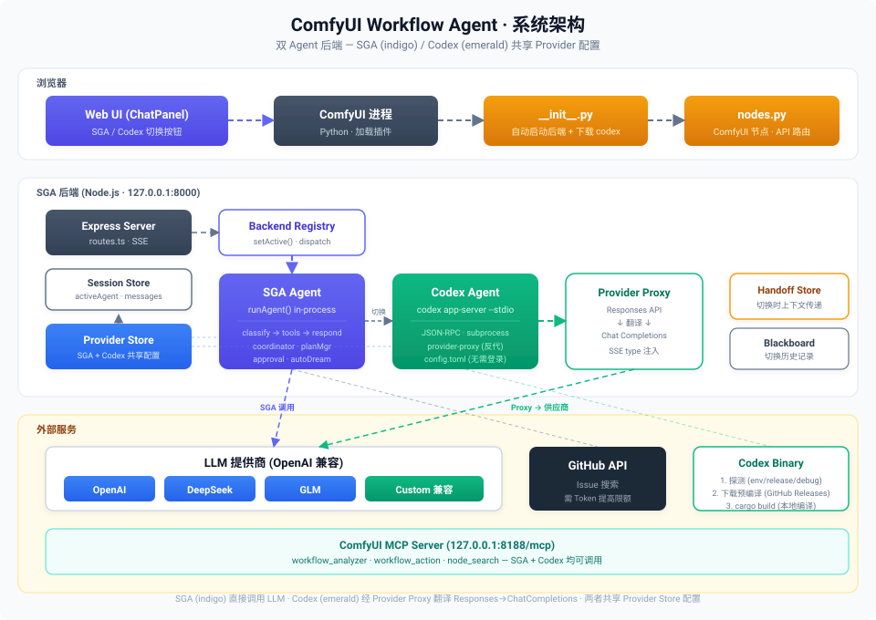
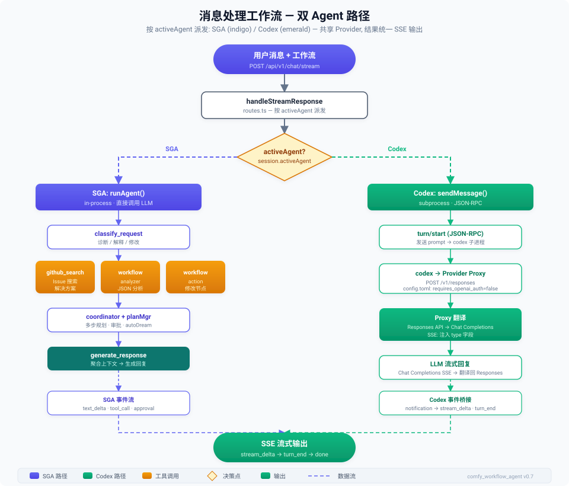
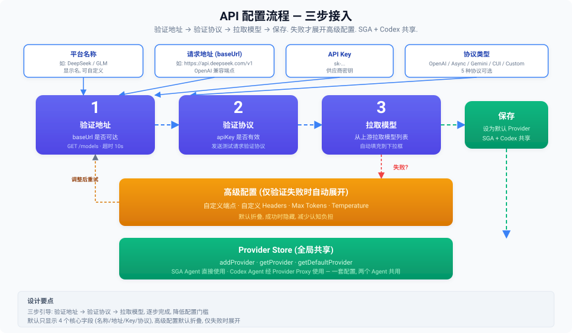
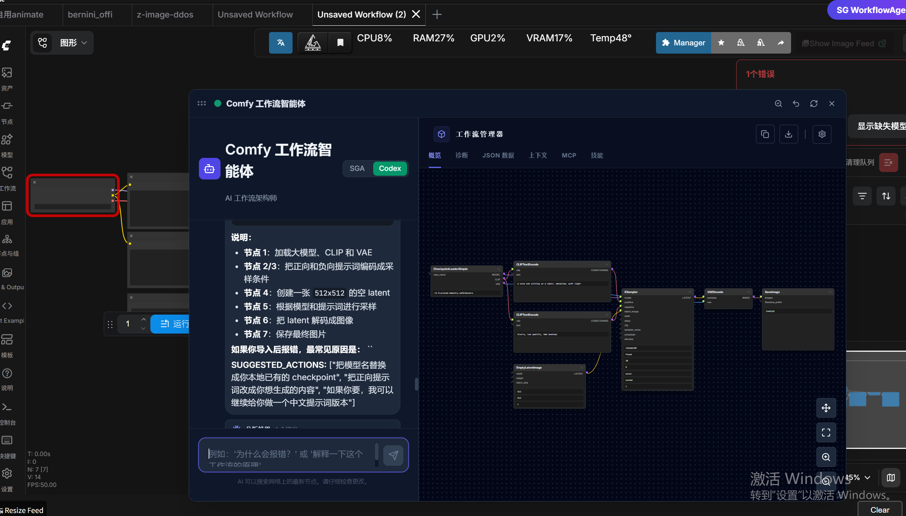
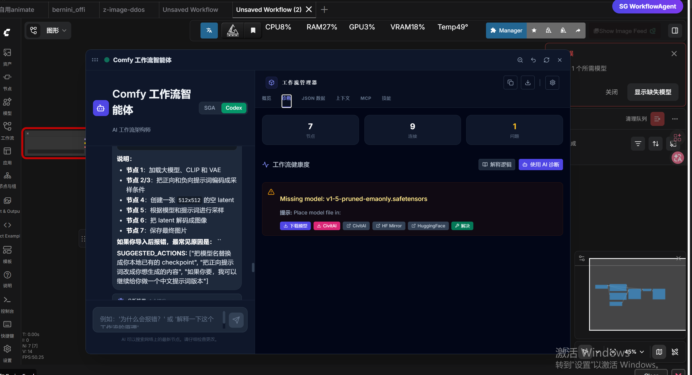
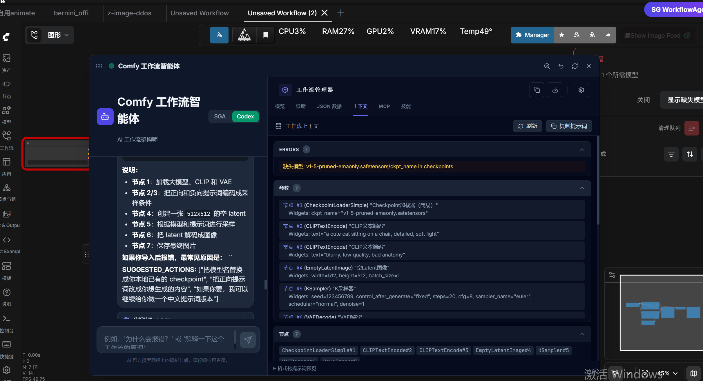
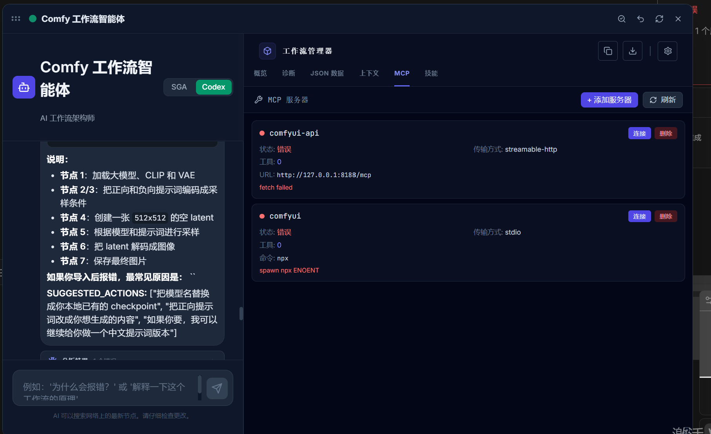
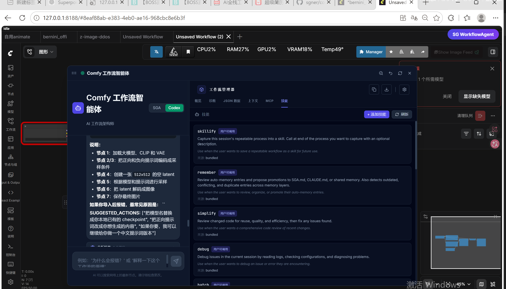

# ComfyUI Workflow Agent

> ComfyUI 自定义节点 · 内嵌 Node.js + TypeScript 的 Agent 后端 (SGA) · 可选 Rust Codex 后端 · 工作流诊断 / 修改 / 解释 / MCP / Skills / 多 LLM 供应商

[](ARCHITECTURE.md)
[](docs/codex-agent-integration.md)
[](#license)

ComfyUI Workflow Agent 是一个 ComfyUI 自定义节点，启动一个本地 Agent 后端并向 ComfyUI 注入工作流专用的聊天面板。默认后端是 **SGA**（基于 Node.js + TypeScript 的 Agent 框架），开箱即用、不依赖 Rust / Codex / OpenAI 登录。**Codex** 是面向高级用户的可选 Rust 后端，仅在 vendored `codex-app-server` 二进制可用时才可切换。



## 当前状态

| 层 | 状态 | 说明 |
|---|---|---|
| **SGA 后端** | 稳定默认 | 随 ComfyUI 自动启动；负责 chat、工作流分析、工具调用、记忆、Skills、MCP、Provider 配置 |
| **React UI** | 稳定默认 | Chat / Providers / 工作流诊断 / 系统诊断 / MCP / Skills / SGA·Codex 切换 |
| **Codex 后端** | 可选 / 实验 | 需要 vendored `codex-app-server` 二进制或 `CODEX_BINARY`；显式拒绝 OpenAI 官方 CLI；缺失 / 编译失败 / 不可用均不影响 SGA |
| **诊断 API** | 可用 | `/api/v1/diagnostics`、`/api/v1/codex/status`、`/api/v1/codex/build-status`、handoff 状态 API 均返回脱敏信息 |

## 项目包含

- **Python 入口**：[__init__.py](__init__.py) — ComfyUI 自定义节点入口，自动探测 / 下载 Node.js、安装依赖、构建 UI、后台启动 SGA 后端，并探测 Codex 能力。
- **SGA 后端**：[sga_template/](sga_template/) — Node.js 20 + TypeScript 5.7 + Express 4.21，提供 `/api/*`（ComfyUI 配置 / chat）和 `/api/v1/*`（Agent / v1）两套路由前缀。
- **React UI**：[ui/](ui/) — React 18 + Vite 5 + Tailwind 3.4，构建产物输出到 [web/](web/)，由 ComfyUI 静态托管。
- **可选 Codex Rust 源码**：[sga_template/codex-rs/](sga_template/codex-rs/) — vendored `codex-rs`（Apache-2.0），含本项目定制的 `comfyui_agent.rs` 身份注入层。
- **Provider 适配**：OpenAI / Anthropic / Gemini / DeepSeek / GLM / 通义 / Moonshot / 任意 OpenAI 兼容端点。
- **30+ 内置工具**：工作流分析器、工作流动作、ComfyUI API、节点搜索、模型列表、Bash / File / Glob / Grep / WebFetch / WebSearch / GitHub Search / HuggingFace / Civitai / Todo / Plan / Skill …
- **MCP 集成**：streamable-http / sse / stdio 三种 transport；自动注册 ComfyUI 自身的 `/mcp` 端点；运行时增删即写盘 `<SGA_HOME>/mcp-servers.json`，重启后自动恢复。
- **Skills 系统**：bundled skills（`remember` / `stuck` / `workflow-create` / `workflow-debug` / `model-explore` / `workflow-optimize` / `verify` …）+ 用户自定义 skills，三种添加方式：API / 文件系统 / Agent 自动生成。
- **多语言 UI**：zh / en / ja / ko 四语种嵌入式字典。
- **可观测性**：feature gates、telemetry、cost tracker、circuit breaker、context budget、handoff audit。

## 快速开始

把仓库放到 ComfyUI 的 `custom_nodes/` 目录：

```bash
cd ComfyUI/custom_nodes
git clone <repository-url> comfy_workflow_agent
```

启动 ComfyUI 即可。插件启动时会按需：

1. 探测系统 Node.js；缺失则自动下载 `NODE_VERSION=20.18.0` 到 `.node-runtime/`。
2. 在 `sga_template/` 跑 `npm install` + `npm run build`（用 `_InstallLock` 跨进程锁防并发）。
3. 在 `ui/` 跑 `npm install` + `npm run build` 输出到 `web/`（缺失或空时）。
4. 自动维护 `<SGA_HOME>/mcp-servers.json`，把 `http://127.0.0.1:8188/mcp` 注册为 `comfyui-api` MCP server。
5. 后台探测 Codex：vendored 源码在 → 自动后台 `cargo build`（不阻塞 SGA）；显式 `CODEX_SKIP_BUILD=1` 跳过。
6. Popen 启动 `node dist/server/main.js`，5 分钟内最多 3 次自动重启，stdout 流式转发到 ComfyUI 控制台。
7. 轮询 `/api/health` 直到 200，默认 `http://127.0.0.1:8000`。

预期启动日志（UTF-8 / ASCII 可读）：

```text
============================================================
Starting ComfyUI Workflow Agent Backend Server (SGA)
============================================================
Host: 127.0.0.1
Port: 8000
Health API: http://127.0.0.1:8000/api/health
============================================================
```

## 系统架构


三层进程模型：

```
ComfyUI (Python)  ──►  __init__.py  ──►  SGA backend (Node.js, :8000)
                                              ├── SGA Agent  (in-process runAgent)
                                              ├── Codex Agent (subprocess, JSON-RPC over stdio)
                                              ├── Provider Store  (SGA + Codex 共享)
                                              ├── Handoff Store + Blackboard
                                              └── MCP client (连 ComfyUI /mcp + 用户 MCP)
```

- **ComfyUI 主进程**：Python 加载 `__init__.py`，探测 Node.js、安装依赖、Popen 启动 SGA 子进程。
- **SGA 后端**：Express 监听 `:8000`，路由分 `/api/*`（ComfyUI 配置 / chat）和 `/api/v1/*`（Agent / v1）。
- **Codex 子进程**（可选）：`codex-app-server -c sandbox_mode=workspace-write`，JSON-RPC over stdio；前置本地 HTTP `provider-proxy`（Responses → Chat Completions 反代），临时写 `config.toml` 设置 `requires_openai_auth=false`，**不需要 ChatGPT 登录**。

详见 [ARCHITECTURE.md](ARCHITECTURE.md) 与 [docs/tech-stack.md](docs/tech-stack.md)。

## 消息处理工作流



`POST /api/v1/chat/stream`（或 `/api/chat/stream`）按 `session.activeAgent` 派发：

- **SGA 路径（indigo）**：`runAgent()` 进程内执行 → `classify_request` → 工具调用（`workflow_analyzer` / `workflow_action` / `github_search` / ComfyUI API / MCP …）→ `coordinator + plan-manager`（多步规划 / 审批 / autoDream）→ `generate_response`。
- **Codex 路径（emerald）**：`sendMessage()` → `thread/start`（JSON-RPC）→ codex 子进程 → provider-proxy 翻译 → LLM 流式回复 → `event-bridge` 翻译回 SGA `AgentStreamEvent`。

两路汇合到统一的 **SSE 流式输出**（`stream_delta` → `turn_end` → `done`）。

## API 概览

完整路由在 [sga_template/src/server/app.ts](sga_template/src/server/app.ts)，handler 在 [routes.ts](sga_template/src/server/routes.ts) 与 [skills-mcp-routes.ts](sga_template/src/server/skills-mcp-routes.ts)。共 84 个 `/api/v1/*` 端点 + 22 个 `/api/*` 端点，下表只列关键入口。

### ComfyUI 配置与聊天（`/api/*`）

| Method | Path | 用途 |
|---|---|---|
| `GET` | `/api/health` | 最小健康检查（返回 `version: "2.0.0"`） |
| `POST` | `/api/chat/stream` | SSE 流式聊天（ComfyUI 工作流上下文） |
| `GET` | `/api/chat/history/:sessionId` | 取会话历史 |
| `POST` | `/api/chat/abort/:sessionId` | 中断流式 |
| `POST` | `/api/workflow/parse` / `/api/workflow/analyze` | 解析 / 分析工作流 JSON |
| `POST` | `/api/actions/execute` / `/api/actions/undo` | 工作流动作执行 / 撤销 |
| `POST` | `/api/user-input` | 提交审批 / 用户输入 |
| `GET` / `POST` / `PUT` / `DELETE` | `/api/configs[/:id]` | AI 供应商配置 CRUD |
| `POST` | `/api/configs/set-default` | 设默认 Provider |
| `GET` / `PUT` / `DELETE` | `/api/github-token` | GitHub Token 增删查 |
| `POST` | `/api/fork` / `/api/coordinator` / `/api/auto-dream` | 子 Agent / 协调器 / AutoDream |

### Agent v1（`/api/v1/*`，`BASE_PATH` 可覆盖）

| 分组 | 代表端点 |
|---|---|
| **Health & 诊断** | `GET /health`、`GET /diagnostics` |
| **Sessions** | `POST /sessions`、`POST /sessions/:id/messages`（SSE）、`POST /sessions/:id/agent`（切换 SGA↔Codex）、`GET /sessions/:id/handoff/status`、`GET /sessions/:id/cost` |
| **Agents & 协调** | `GET /agents`、`POST /coordinate`、`POST /coordinate/plan` |
| **Backends / Codex** | `GET /backends`、`GET /backends/health`、`GET /codex/status`、`GET /codex/build-status` |
| **Tasks & Tools** | `GET /tasks`、`DELETE /tasks/:id`、`GET /tools` |
| **Permissions & Hooks** | `GET/POST/DELETE /permissions/rules`、`POST /permissions/check`、`GET/POST/DELETE /hooks` |
| **Feature Gates** | `GET /feature-gates`、`POST /feature-gates/override`、`POST /feature-gates/reset-all` |
| **Telemetry** | `GET /telemetry/status`、`POST /telemetry/toggle`、`GET /telemetry/events` |
| **Memories** | `GET /memories`、`POST /memories/search`、`POST /memories/extract` |
| **Providers** | `GET /providers`、`POST /providers/verify-address`、`POST /providers/verify-protocol`、`POST /providers/fetch-models`、`POST /providers/verify-and-add` |
| **Skills** | `GET /skills`、`GET /skills/discover`、`POST /skills`、`DELETE /skills/:name` |
| **MCP** | `GET /mcp/servers`、`POST /mcp/servers`（注册 + 自动连接 + 持久化）、`POST /mcp/servers/:name/connect`、`GET /mcp/tools` |
| **Classify / Config** | `POST /classify/bash`、`POST /system-prompt/preview`、`GET /config[/:section]` |
| **Circuit Breaker / Context Budget** | `GET /circuit-breaker`、`POST /circuit-breaker/reset`、`GET /context-budget` |

### Provider 三步配置流程



UI 在 **Settings → Manage AI Providers** 引导三步接入：**验证地址**（GET `/models`，10s 超时）→ **验证协议**（apiKey + 测试请求）→ **拉取模型**（自动填充下拉）。失败才展开高级配置（自定义端点 / Headers / Max Tokens / Temperature）。配置统一写入 Provider Store，SGA 与 Codex 共享。

### 关键状态码

- Codex 切换错误码：`CODEX_DISABLED` / `CODEX_NOT_READY` / `CODEX_BUILD_FAILED`
- 默认 `/api/health` 返回 `version: "2.0.0"`；`/api/v1/health` 返回完整健康信息

## Codex 能力


### 启用控制

| `SGA_ENABLE_CODEX` | 行为 |
|---|---|
| `auto`（默认） | 探测 vendored 源 / 二进制并上报 capability 状态；SGA 始终可用 |
| `true` | 保持 Codex 启用，但切换仍要求 `state=ready`，否则返回结构化错误 |
| `false` | 完全禁用 Codex；切换到 Codex 返回 `CODEX_DISABLED` |

### 二进制获取（三级 fallback）

1. **`CODEX_BINARY` 环境变量** — 显式覆盖路径
2. **Vendored 构建产物** — `sga_template/codex-rs/target/{release,debug}/codex-app-server[.exe]`
3. **后台 `cargo build`** — 源码在但二进制不在时，`__init__.py` spawn `scripts/build_codex_worker.py` 后台编译（首次 5-20 分钟，进度写到 `<SGA_HOME>/codex-build.json` + `.log`，UI 通过 `GET /api/v1/codex/build-status` 轮询）

> ⚠️ **OpenAI 官方 `codex` CLI / `%LOCALAPPDATA%\OpenAI\Codex\` 安装 / PATH `codex` 均被显式拒绝**。原因：官方构建缺少本项目定制的 `comfyui_agent.rs` 身份注入层，会回退到默认 Codex CLI 人设（"What do you want changed?"），破坏 Comfy Workflow Agent 的统一框架。详见 [DEVLOG.md 2026-06-23](DEVLOG.md)。

### Capability 状态

`GET /api/v1/codex/status` 返回脱敏状态：

| State | 含义 | 可切换到 Codex |
|---|---|---|
| `disabled` | `SGA_ENABLE_CODEX=false` | ❌ |
| `unavailable` | 没有兼容的源码 / 二进制 | ❌ |
| `source-present` | vendored 源码在但二进制未就绪 | ❌ |
| `building` | 后台 `cargo build` 进行中 | ❌ |
| `ready` | 兼容 `codex-app-server` 二进制可用 | ✅ |
| `failed` | 探测 / 构建失败 | ❌ |

### 共享上下文（让 Codex 与 SGA 行为一致）

- **身份注入**：`sga_template/codex-rs/core/src/comfyui_agent.rs` 在每次模型请求前，注入 `## IDENTITY OVERRIDE (HIGHEST PRIORITY)` 块，1:1 镜像 SGA 的 `comfyui-agent.ts` 身份。`OnceCell` 缓存，每个进程只构建一次。
- **环境上下文**：`build_env_context()` 扫描 `COMFYUI_BASE_DIR`、`SGA.md`、`extra_model_paths.yaml`、`custom_nodes/`、已装 Python 包。
- **共享黑板**：`build_blackboard_section()` 读 `<SGA_HOME>/shared/blackboard.json`（由 SGA `blackboard.ts` 写入），含当前任务、keyFacts、最近 agent 动作。
- **Live 工作流上下文**：SGA 端 [sga_template/src/comfyui/live-context.ts](sga_template/src/comfyui/live-context.ts) 在每次 `handleComfyUIChatStream` 把 `workflow.json` / `workflow-summary.json` / `frontend-context.txt` / `error-log.txt` 原子写到 `<SGA_HOME>/shared/comfyui/`；Codex 端 `build_live_context_section()` 读这些文件，**绝不截断**（≤64KB 内联，否则给文件路径 + `read_file` 提示）。
- **developerInstructions**：SGA 端 [sga_template/src/agents/codex/context.ts](sga_template/src/agents/codex/context.ts) 在 `thread/start` 注入 `SGA.md` + blackboard + live context + recent session + language override，作为 Rust 端的兜底。

### Handoff 与审计

切换 SGA ↔ Codex 时：

- 源 agent `exportHandoff()` → `HandoffBundle`（recentMessages ≤20、workingSetSummary、sessionMemory、keyFacts ≤20、userPreferences）→ 原子写到 `<SGA_HOME>/handoff/<sessionId>.json` + `.history.json` + `.audit.json`
- 目标 agent `importHandoff()` 一次性消费（读后删）
- `GET /api/v1/sessions/:sessionId/handoff/status` 返回审计摘要（导出 / 导入计数、warning / error 摘要、时间戳），**不**包含完整消息体或密钥

详见 [docs/codex-agent-integration.md](docs/codex-agent-integration.md)。

## 系统诊断

`GET /api/v1/diagnostics` 聚合并脱敏：

```json
{
  "status": "ok",
  "backend": { "healthy": true, "version": "2.0.0" },
  "providers": { "count": 2, "defaultProvider": "openai", "missingKeys": [] },
  "codex": { "state": "ready", "canSwitchToCodex": true },
  "mcp": { "connected": 1, "total": 1 },
  "comfyui": { "reachable": true },
  "errors": []
}
```

**永不返回**：API keys、tokens、Authorization headers、完整 secret 值。

UI 中 **System Diagnostics 面板**与工作流诊断面板**分开**：前者关注后端 / Provider / Codex / MCP / ComfyUI 状态，后者关注工作流图本身的问题（缺模型 / 缺节点 / 连接错误等）。

## 截图

| 截图 | 说明 |
|---|---|
|  | 主界面：左 Chat + 右 Visualizer（Overview / Diagnostics / JSON / Context / MCP / Skills） |
|  | 工作流诊断：按 severity 过滤、运行时错误、缺模型 / 缺节点修复入口 |
|  | 上下文面板：errors / parameters / nodes / settings / node defs，一键复制为 Prompt |
|  | MCP 管理：增删 server、自动连接、transport 白名单校验、env字段 |
|  | Skills 管理：bundled + 用户自定义、API / 文件 / Agent 三种添加方式 |

## 数据存储

文件系统 JSON，简单可靠、便于备份 / 迁移：

| 数据 | 典型位置 |
|---|---|
| Provider configs | `~/.sga/comfyui/api_configs/`（或 `COMFYUI_CONFIG_DIR`） |
| Provider runtime store | `<SGA_HOME>/sga-provider.json` |
| Sessions | `SGA_HOME` 管理的 session 存储 |
| Memories | `<SGA_HOME>/memories/{global,project,session}/` |
| Skills | `<SGA_HOME>/skills/` + bundled |
| MCP servers | `<SGA_HOME>/mcp-servers.json` |
| Handoff bundles / audits | `<SGA_HOME>/handoff/` |
| Shared blackboard | `<SGA_HOME>/shared/blackboard.json` |
| Live ComfyUI context | `<SGA_HOME>/shared/comfyui/{workflow,workflow-summary,frontend-context,error-log}.json` |
| Codex build state | `<SGA_HOME>/codex-build.json` + `<SGA_HOME>/codex-build.log` |
| Install lock | `<SGA_HOME>/install.lock` |

`SGA_HOME` 默认 `~/.sga`，可通过环境变量覆盖。

## 环境变量（关键）

完整列表见 [sga_template/.env.example](sga_template/.env.example)（70+ 项）。

### ComfyUI 连接

| 变量 | 默认 | 说明 |
|---|---|---|
| `COMFYUI_HOST` | `127.0.0.1` | ComfyUI 主机 |
| `COMFYUI_PORT` | `8188` | ComfyUI 端口 |
| `CODEX_COMFYUI_MCP_URL` | `http://127.0.0.1:8188/mcp` | 写入 codex `config.toml` 的 MCP server |

### SGA 后端

| 变量 | 默认 | 说明 |
|---|---|---|
| `PORT` / `HOST` | `8000` / `127.0.0.1` | SGA 监听 |
| `SGA_HOME` | `~/.sga` | 数据根目录 |
| `SGA_API_KEY` | — | 可选 API 鉴权 |
| `BASE_PATH` | `/api/v1` | v1 路由前缀（可改） |
| `NODE_VERSION` | `20.18.0` | 自动安装 Node.js 版本 |

### Codex

| 变量 | 默认 | 说明 |
|---|---|---|
| `SGA_ENABLE_CODEX` | `auto` | `auto` / `true` / `false` |
| `CODEX_BINARY` | — | 显式指定 `codex-app-server` 路径 |
| `CODEX_SKIP_BUILD` | — | `1` 跳过后台 `cargo build` |
| `CODEX_DEFAULT_MODEL` | `gpt-5-codex` | Codex 默认模型 |
| `CODEX_SANDBOX_MODE` | `workspace-write` | Codex 沙箱模式 |
| `CODEX_MAX_RESTARTS` | `3` | 子进程崩溃自动重启上限 |
| `CARGO_BUILD_TIMEOUT` | `1800` | 后台编译超时（秒） |

### ComfyUI Agent 特性开关（节选）

| 变量 | 默认 | 说明 |
|---|---|---|
| `SGA_ENABLE_FORK` | `true` | 子 Agent 分叉 |
| `SGA_ENABLE_COORDINATOR` | `true` | 多 Agent 协调器 |
| `SGA_ENABLE_AUTODREAM` | `true` | 记忆整合（AutoDream） |
| `SGA_AUTO_INJECT_WORKFLOW_CONTEXT` | `true` | 自动注入工作流上下文 |
| `SGA_ENABLE_RETRY` | `true` | 工具失败重试 |
| `SGA_ENABLE_ADVISOR_ON_FAILURE` | `true` | 失败时 Advisor 顾问反思 |

## 验证基线

后端：

```bash
cd sga_template
npm run typecheck
npm test
```

前端：

```bash
cd ui
npm run typecheck
npm run lint
npm run build
```

这些检查默认**不依赖**真实 Codex binary、网络访问或外部 API key。

## 开发

详见 [DEVELOPMENT.md](DEVELOPMENT.md)。

简要：

```bash
# 后端热重载
cd sga_template && npm run dev        # tsx watch src/server/main.ts

# 前端热重载
cd ui && npm run dev                 # vite dev server

# 构建 Codex（可选）
node scripts/build-codex.mjs --app-server
# 或
cd sga_template/codex-rs && cargo build --release -p codex-app-server
```

## 文档

| 文档 | 说明 |
|---|---|
| [ARCHITECTURE.md](ARCHITECTURE.md) | 当前架构与运行时边界 |
| [DEVELOPMENT.md](DEVELOPMENT.md) | 开发工作流、代码组织、扩展指南 |
| [DEVLOG.md](DEVLOG.md) | 时间倒序的开发日志 |
| [CHANGELOG.md](CHANGELOG.md) | 发布版本记录 |
| [docs/codex-agent-integration.md](docs/codex-agent-integration.md) | Codex 能力状态、API 行为、完成矩阵 |
| [docs/tech-stack.md](docs/tech-stack.md) | 技术栈总览 |
| [docs/rust-install-guide.md](docs/rust-install-guide.md) | 可选 Rust / Codex 构建指南 |
| [docs/release-codex.md](docs/release-codex.md) | 预编译 Codex binary 发布流程 |
| [docs/workflow-domain-capability-plan.md](docs/workflow-domain-capability-plan.md) | ComfyUI 工作流领域能力的未来计划 |

## License

本项目代码采用 **MIT** 协议。vendored Codex Rust 源码（[sga_template/codex-rs/](sga_template/codex-rs/)）保留上游 Apache-2.0 协议，详见 [sga_template/codex-rs/README-VENDORED.md](sga_template/codex-rs/README-VENDORED.md) 与 [NOTICE](sga_template/codex-rs/NOTICE)。
