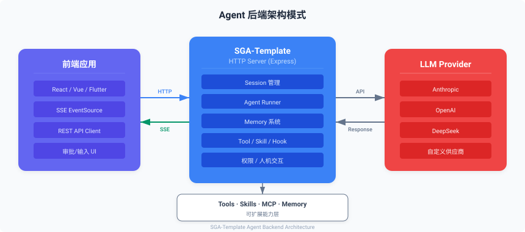

# 为任何产品提供 Agent 后端

> 📄 相关源文件：`src/server/app.ts`（Express 应用）、`src/server/routes.ts`（核心路由）、`src/server/session.ts`（会话管理）

## 概述

SGA-Template 的 HTTP 服务层设计为可嵌入任何产品的前端后端架构中，作为 Agent 能力的后端服务。无论是 Web 应用、桌面应用还是移动应用，都可以通过 REST API 和 SSE 与 Agent 交互。

## 架构模式



## 集成方式

### 方式一：独立部署

将 SGA-Template 作为独立的微服务部署：

```bash
# 构建
npm run build

# 启动生产服务
npm run start:dist
```

前端通过 HTTP 请求与 Agent 服务交互。

### 方式二：嵌入现有 Node.js 服务

```typescript
import express from 'express'
import { createApp } from 'SGA-Template'

const app = express()

// 挂载 Agent 路由
const agentApp = await createApp({
  port: 3001,
  provider: {
    name: 'openai',
    apiKey: process.env.LLM_API_KEY!,
    baseUrl: process.env.LLM_BASE_URL,
    defaultModel: 'deepseek-chat',
  },
})

// 将 Agent 路由挂载到子路径
app.use('/agent', agentApp)

app.listen(3000)
```

### 方式三：作为库调用

```typescript
import { runAgent, createBuiltinTools, getBuiltinAgentDefinitions } from 'SGA-Template'

// 在你的业务逻辑中直接调用
app.post('/api/chat', async (req, res) => {
  const { message, history } = req.body

  const result = await runAgent({
    agentDefinition: getBuiltinAgentDefinitions()[0],
    prompt: message,
    messages: history,
    tools: createBuiltinTools(),
    model: 'sonnet',
    onProgress: (event) => {
      // 通过 WebSocket 推送进度
      ws.send(JSON.stringify(event))
    },
  })

  res.json({ reply: result.content })
})
```

## 前端集成要点

### 1. 创建会话

```javascript
const response = await fetch('/api/v1/sessions', {
  method: 'POST',
  headers: { 'Content-Type': 'application/json' },
  body: JSON.stringify({
    model: 'sonnet',
    maxTurns: 50,
    permissionMode: 'bypassPermissions',
    provider: {
      name: 'openai',
      apiKey: 'sk-xxx',
      baseUrl: 'https://api.deepseek.com/v1',
      defaultModel: 'deepseek-chat',
    },
  }),
})
const { id: sessionId } = await response.json()
```

### 2. 发送消息并接收流式响应

```javascript
const response = await fetch(`/api/v1/sessions/${sessionId}/messages`, {
  method: 'POST',
  headers: { 'Content-Type': 'application/json' },
  body: JSON.stringify({ content: userMessage, stream: true }),
})

const reader = response.body.getReader()
const decoder = new TextDecoder()

while (true) {
  const { done, value } = await reader.read()
  if (done) break

  const text = decoder.decode(value)
  const lines = text.split('\n')

  for (const line of lines) {
    if (line.startsWith('event: ')) {
      currentEvent = line.slice(7)
    } else if (line.startsWith('data: ')) {
      const data = JSON.parse(line.slice(6))
      handleSSEEvent(currentEvent, data)
    }
  }
}
```

### 3. 处理人机交互

```javascript
function handleSSEEvent(eventType, data) {
  switch (eventType) {
    case 'text_delta':
      appendToChat(data.data)
      break
    case 'tool_use_start':
      showToolIndicator(data.data.name)
      break
    case 'approval_required':
      showApprovalDialog(data.data, async (approved) => {
        await fetch(`/api/v1/sessions/${sessionId}/input`, {
          method: 'POST',
          headers: { 'Content-Type': 'application/json' },
          body: JSON.stringify({
            type: 'approval',
            response: approved ? 'allow' : 'deny',
          }),
        })
      })
      break
    case 'human_input_required':
      showInputDialog(data.data, async (value) => {
        await fetch(`/api/v1/sessions/${sessionId}/input`, {
          method: 'POST',
          headers: { 'Content-Type': 'application/json' },
          body: JSON.stringify({
            type: 'human_input',
            response: value,
          }),
        })
      })
      break
    case 'done':
      hideLoadingIndicator()
      break
  }
}
```

## 安全建议

1. **API Key 保护**：不要在前端暴露 LLM API Key，始终通过后端代理
2. **CORS 配置**：配置 `createApp` 的 CORS 选项限制允许的来源
3. **权限模式**：生产环境建议使用 `default` 或 `plan` 模式，而非 `bypassPermissions`
4. **速率限制**：在反向代理层添加速率限制
5. **输入验证**：对用户输入进行验证和清理

## 相关文档

- [作为后端服务使用](backend-service.md)
- [人机交互机制](human-interaction.md)
- [多供应商 LLM 接入](multi-provider.md)
- [API 参考](api-reference.md)
