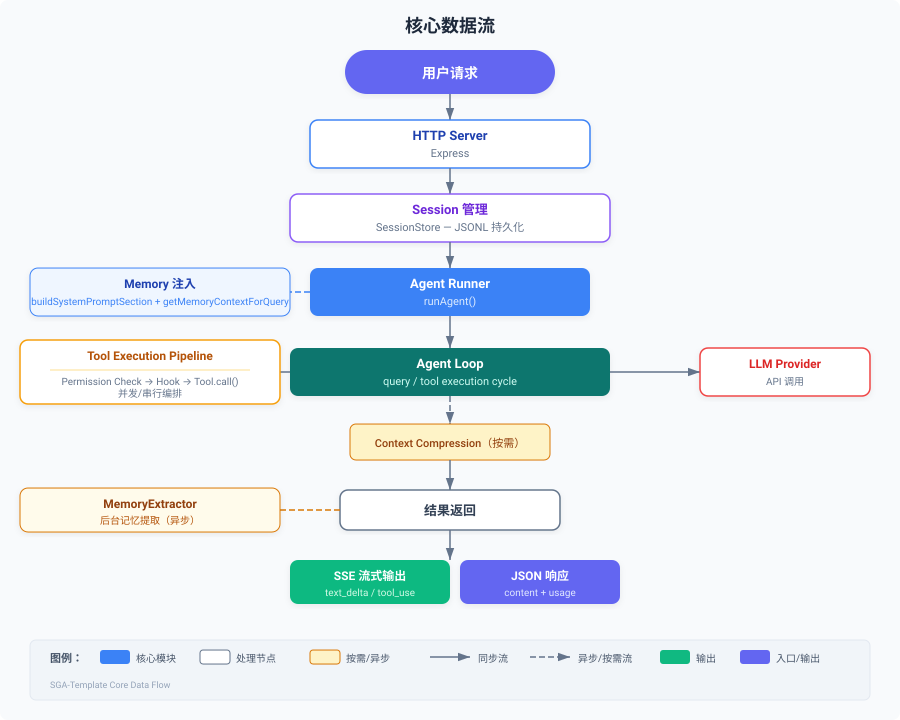

# 项目架构

> 📄 相关源文件：`src/` 目录下所有模块

## 整体结构

SGA-Template 采用分层模块化架构，各模块职责清晰、松耦合，可独立使用或组合使用。

```
src/
├── core/           # 核心类型与状态机
│   ├── types.ts        # Message, UsageMetrics, PermissionMode 等基础类型
│   ├── state.ts        # Agent 状态机（创建与转移）
│   └── agent.ts        # 核心 Agent 查询入口
├── agents/         # Agent 定义与运行
│   ├── definition.ts   # AgentDefinition 接口、BaseAgentDefinition 基类
│   ├── runner.ts       # Agent 执行引擎（runAgent）
│   ├── fork.ts         # 子 Agent 分叉执行
│   └── built-in/       # 内置 Agent 定义
├── tools/          # 工具系统
│   ├── base.ts         # Tool 接口、BaseTool 基类
│   ├── registry.ts     # ToolRegistry 工具注册中心
│   ├── execution.ts    # 工具执行管线与编排
│   └── built-in/       # 内置工具
├── api/            # LLM API 客户端
│   ├── client.ts       # APIClient（支持流式/非流式）
│   └── types.ts        # API 请求/响应类型
├── providers/      # 多供应商 LLM 接入
│   ├── types.ts        # Provider 统一接口定义
│   ├── anthropic.ts    # Anthropic 供应商实现
│   ├── openai.ts       # OpenAI 兼容供应商实现
│   ├── registry.ts     # 供应商注册中心与工厂
│   └── index.ts        # 统一导出
├── context/        # 上下文管理
│   ├── system-prompt.ts # 系统提示词构建
│   ├── compression.ts   # 上下文压缩
│   └── claudemd.ts      # SGA.md / CLAUDE.md 加载（SGA 优先，CLAUDE 兼容）
├── memory/         # 记忆系统
│   ├── types.ts        # 记忆类型定义与常量
│   ├── paths.ts        # 记忆文件路径管理（三级优先级 + 安全校验）
│   ├── scanner.ts      # 记忆文件扫描与 frontmatter 解析
│   ├── retrieval.ts    # 智能检索（LLM 选择 + 关键词兜底）
│   ├── prompt.ts       # 记忆提示词构建与提取提示词
│   ├── manager.ts      # MemoryManager 核心管理器（初始化/缓存/检索/持久化）
│   ├── extractor.ts    # MemoryExtractor 自动记忆提取（后台 LLM 提取）
│   └── index.ts        # 统一导出
├── skills/         # 技能系统
│   ├── types.ts             # 技能类型定义
│   ├── discovery.ts         # 技能发现（从目录扫描）
│   ├── activation.ts        # 技能激活
│   ├── bundled-registry.ts  # 技能注册中心
│   └── bundled/             # 内置技能
├── permissions/    # 权限系统
│   └── checker.ts      # PermissionChecker 权限检查器
├── hooks/          # Hook 钩子系统
│   ├── types.ts        # Hook 事件类型
│   └── executor.ts     # Hook 注册与执行
├── mcp/            # MCP 协议集成
│   ├── types.ts        # MCP 类型定义
│   ├── client.ts       # MCP 客户端
│   ├── manager.ts      # MCP 管理器
│   └── index.ts        # 统一导出
├── tasks/          # 任务系统
│   └── manager.ts      # TaskManager 任务管理
├── teams/          # 团队协作
│   ├── types.ts        # 团队类型定义
│   └── mailbox.ts      # 团队消息邮箱
├── server/         # HTTP 服务层
│   ├── app.ts                # Express 应用创建与路由注册（含 MemoryManager 初始化）
│   ├── routes.ts             # 核心 REST API 路由（含记忆提取触发）
│   ├── session.ts            # 会话类型定义
│   ├── session-store.ts      # SessionStore 会话持久化（JSONL 追加写入 + 自动迁移）
│   ├── interaction.ts        # 人机交互类型定义
│   ├── skills-mcp-routes.ts  # Skills 与 MCP 管理 API
│   ├── main.ts               # 服务启动入口（含优雅关闭）
│   └── index.ts              # 服务层统一导出
└── utils/          # 工具函数
    ├── helpers.ts      # 通用工具函数
    ├── logger.ts       # 日志系统
    └── cost-tracker.ts # 成本追踪
```

## 核心数据流



## 模块依赖关系

| 模块 | 依赖 | 被依赖 |
|------|------|--------|
| `core` | 无 | 所有模块 |
| `providers` | `core` | `api`, `server` |
| `api` | `core`, `providers` | `agents`, `server` |
| `tools` | `core` | `agents`, `server` |
| `agents` | `core`, `tools`, `context` | `server` |
| `context` | `core` | `agents` |
| `permissions` | `core` | `tools`, `agents` |
| `hooks` | `core` | `tools`, `agents` |
| `memory` | `core`, `providers` | `agents`, `server` |
| `skills` | `core`, `tools` | `server` |
| `mcp` | `core`, `tools` | `server` |
| `tasks` | `core` | `agents`, `server` |
| `teams` | `core` | `agents`, `server` |
| `server` | 所有模块 | 无 |

## 相关文档

- [快速开始](quick-start.md)
- [作为后端服务使用](backend-service.md)
- [作为库使用](library-usage.md)
- [自定义工具](custom-tools.md)
- [自定义 Agent](custom-agent.md)
