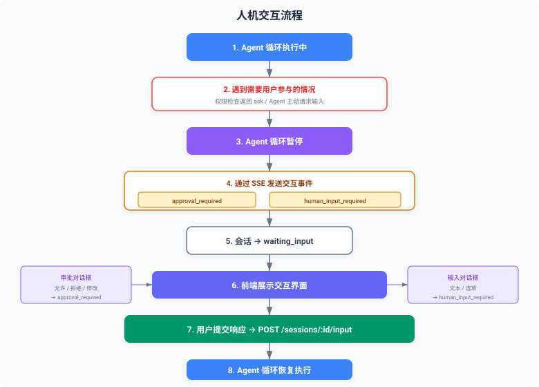

# 人机交互机制

> 📄 相关源文件：`src/server/interaction.ts`（交互类型定义）、`src/core/agent.ts`（Agent 循环暂停/恢复）、`src/server/routes.ts`（用户输入 API）

## 概述

在 Agent 执行过程中，有些场景需要用户参与决策或提供额外信息。SGA-Template 的人机交互机制允许 Agent 在需要时暂停执行，等待用户输入后继续。

## 交互类型

### 1. 审批请求（Approval Required）

当工具执行需要用户确认时触发（例如权限检查返回 `ask`）：

```typescript
// src/server/interaction.ts
export interface ApprovalAction {
  type: 'approval'
  toolName: string
  toolInput: Record<string, unknown>
  message: string
  suggestions?: string[]
}
```

### 2. 输入请求（Human Input Required）

当 Agent 需要用户提供额外信息时触发：

```typescript
// src/server/interaction.ts
export interface InputRequestAction {
  type: 'human_input'
  message: string
  options?: Array<{ label: string; value: string }>
}
```

## 交互流程



## SSE 交互事件

### approval_required 事件

```
event: approval_required
data: {
  "type": "approval_required",
  "data": {
    "toolName": "Bash",
    "toolInput": { "command": "rm -rf node_modules" },
    "message": "Bash 工具请求执行删除命令，是否允许？",
    "suggestions": ["允许", "拒绝", "修改命令"]
  },
  "sessionId": "sess-xxx"
}
```

### human_input_required 事件

```
event: human_input_required
data: {
  "type": "human_input_required",
  "data": {
    "message": "请选择部署环境",
    "options": [
      { "label": "开发环境", "value": "dev" },
      { "label": "测试环境", "value": "staging" },
      { "label": "生产环境", "value": "prod" }
    ]
  },
  "sessionId": "sess-xxx"
}
```

## 用户输入 API

### 提交审批/输入

```bash
# 审批：允许执行
curl -X POST http://localhost:3000/api/v1/sessions/{sessionId}/input \
  -H "Content-Type: application/json" \
  -d '{
    "type": "approval",
    "response": "allow"
  }'

# 审批：拒绝执行
curl -X POST http://localhost:3000/api/v1/sessions/{sessionId}/input \
  -H "Content-Type: application/json" \
  -d '{
    "type": "approval",
    "response": "deny"
  }'

# 提供输入
curl -X POST http://localhost:3000/api/v1/sessions/{sessionId}/input \
  -H "Content-Type: application/json" \
  -d '{
    "type": "human_input",
    "response": "prod"
  }'
```

### UserInputRequest 类型

```typescript
// src/server/interaction.ts
export interface UserInputRequest {
  type: 'approval' | 'human_input'
  response: string | boolean
  modifiedInput?: Record<string, unknown>
}
```

| 字段 | 说明 |
|------|------|
| `type` | 输入类型 |
| `response` | 用户响应（字符串或布尔值） |
| `modifiedInput` | 修改后的工具输入（审批时使用） |

## 会话状态

人机交互会影响会话状态：

| 状态 | 说明 |
|------|------|
| `active` | 正常执行中 |
| `waiting_input` | 等待用户输入 |
| `completed` | 执行完成 |
| `error` | 执行出错 |

```typescript
// 检查会话状态
const session = getSession(sessionId)
if (session.status === 'waiting_input') {
  console.log('会话等待用户输入:', session.pendingAction)
}
```

## 前端集成示例

```javascript
// 使用 EventSource 监听 SSE 事件
const eventSource = new EventSource('/api/v1/sessions/{sessionId}/messages?stream=true')

eventSource.addEventListener('approval_required', (event) => {
  const data = JSON.parse(event.data)
  showApprovalDialog(data.data, (response) => {
    fetch('/api/v1/sessions/{sessionId}/input', {
      method: 'POST',
      headers: { 'Content-Type': 'application/json' },
      body: JSON.stringify({
        type: 'approval',
        response: response.approved ? 'allow' : 'deny',
      }),
    })
  })
})

eventSource.addEventListener('human_input_required', (event) => {
  const data = JSON.parse(event.data)
  showInputDialog(data.data, (value) => {
    fetch('/api/v1/sessions/{sessionId}/input', {
      method: 'POST',
      headers: { 'Content-Type': 'application/json' },
      body: JSON.stringify({
        type: 'human_input',
        response: value,
      }),
    })
  })
})
```

## 相关文档

- [权限控制](permissions.md)
- [作为后端服务使用](backend-service.md)
- [为任何产品提供 Agent 后端](agent-backend.md)
