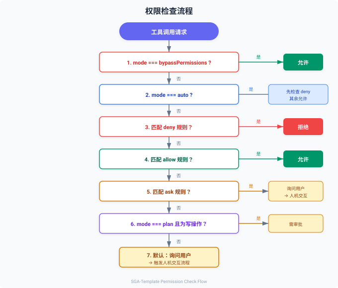

# 权限控制

> 📄 相关源文件：`src/permissions/checker.ts`（PermissionChecker 类）

## 概述

权限系统控制 Agent 可以执行哪些操作。每个工具在执行前都会经过权限检查，确保不会执行未经授权的危险操作。

## PermissionMode

```typescript
// src/core/types.ts
export type PermissionMode =
  | 'default'
  | 'plan'
  | 'acceptEdits'
  | 'bypassPermissions'
  | 'auto'
  | 'bubble'
  | 'dontAsk'
```

| 模式 | 说明 |
|------|------|
| `default` | 默认模式，未匹配规则的工具需要用户确认 |
| `plan` | 计划模式，写操作需要审批 |
| `acceptEdits` | 接受编辑模式，自动允许文件编辑 |
| `bypassPermissions` | 绕过所有权限检查（危险！仅用于可信环境） |
| `auto` | 自动模式，除明确拒绝的规则外全部允许 |
| `bubble` | 冒泡模式，将权限决策传递给上层 |
| `dontAsk` | 不询问模式，未匹配规则时默认拒绝 |

## PermissionChecker

```typescript
import { PermissionChecker } from 'SGA-Template'

const checker = new PermissionChecker({
  mode: 'default',
  rules: {
    allow: [{ tool: 'Read', behavior: 'allow' }],
    deny: [{ tool: 'Bash', pattern: 'rm -rf', behavior: 'deny', reason: '危险命令' }],
    ask: [{ tool: 'Write', behavior: 'ask' }],
  },
  isBypassPermissionsAvailable: true,
  isAutoModeAvailable: true,
  shouldAvoidPermissionPrompts: false,
})
```

### 检查权限

```typescript
const result = checker.check('Bash', { command: 'ls -la' })
// result: { behavior: 'allow' | 'deny' | 'ask', reason?: string, matchedRule?: PermissionRule }
```

### 更新配置

```typescript
checker.updateConfig({
  mode: 'auto',
  shouldAvoidPermissionPrompts: true,
})
```

## PermissionRule

```typescript
// src/permissions/checker.ts
export interface PermissionRule {
  tool: string
  pattern?: string
  behavior: 'allow' | 'deny' | 'ask'
  reason?: string
}
```

| 字段 | 说明 |
|------|------|
| `tool` | 工具名称 |
| `pattern` | 匹配模式（可选，用于匹配工具输入中的特定内容） |
| `behavior` | 匹配时的行为 |
| `reason` | 原因说明 |

## 权限检查流程



## 与人机交互的配合

当权限检查返回 `ask` 时，会触发人机交互流程：

1. Agent 循环暂停
2. 通过 SSE 发送 `approval_required` 事件
3. 前端展示审批界面
4. 用户选择允许/拒绝
5. Agent 循环恢复

详见 [人机交互机制](human-interaction.md)。

## 相关文档

- [人机交互机制](human-interaction.md)
- [自定义工具](custom-tools.md)
- [Hook 钩子系统](hooks.md)
